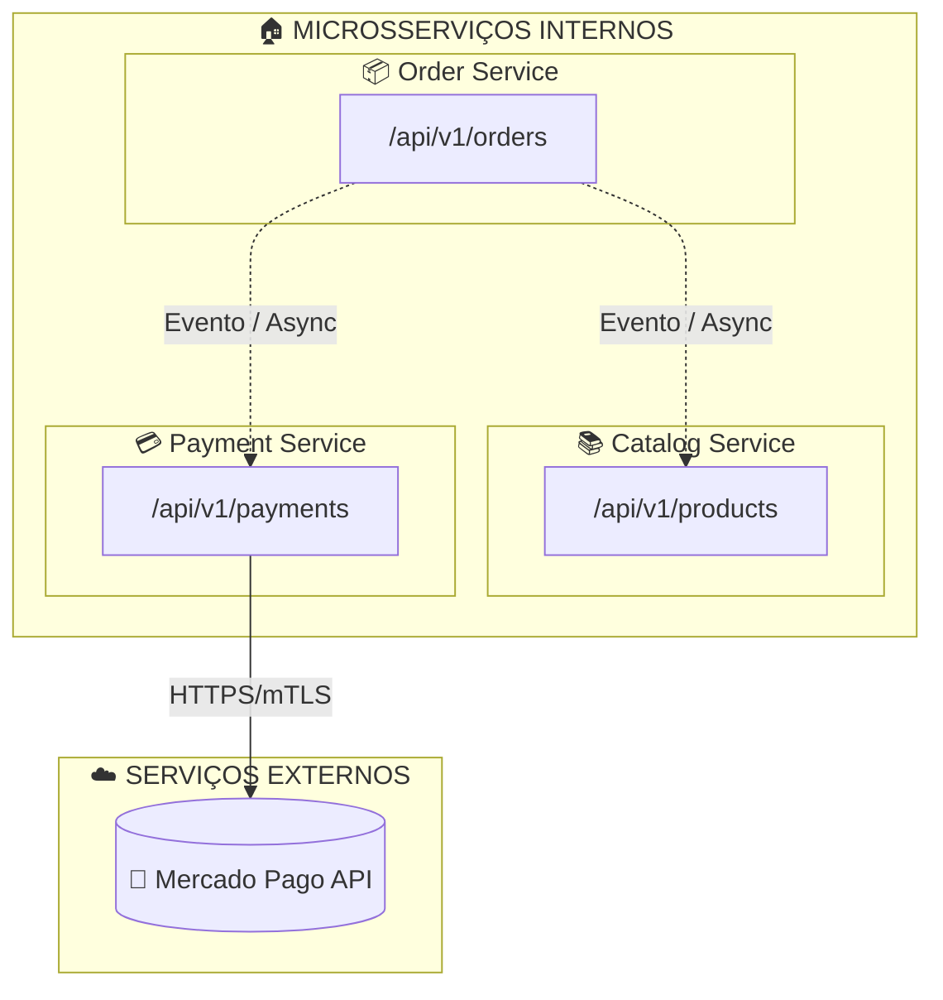

# 💳 FoodCore Payment

<div align="center">

[](https://sonarcloud.io/summary/new_code?id=FIAP-SOAT-TECH-TEAM_foodcore-payment)
[](https://sonarcloud.io/summary/new_code?id=FIAP-SOAT-TECH-TEAM_foodcore-payment)
[](https://sonarcloud.io/summary/new_code?id=FIAP-SOAT-TECH-TEAM_foodcore-payment)
[](https://sonarcloud.io/summary/new_code?id=FIAP-SOAT-TECH-TEAM_foodcore-payment)
[](https://sonarcloud.io/summary/new_code?id=FIAP-SOAT-TECH-TEAM_foodcore-payment)
[](https://sonarcloud.io/summary/new_code?id=FIAP-SOAT-TECH-TEAM_foodcore-payment)

</div>

Microsserviço responsável pelo gerenciamento de pagamentos do sistema FoodCore, incluindo geração de QR Code, integração com Mercado Pago e processamento de webhooks. Desenvolvido como parte do curso de Arquitetura de Software da FIAP (Tech Challenge).

<div align="center">
  <a href="#visao-geral">Visão Geral</a> •
  <a href="#apis">APIs</a> •
  <a href="#arquitetura">Arquitetura</a> •
  <a href="#infra">Infraestrutura</a> •
  <a href="#tecnologias">Tecnologias</a> •
  <a href="#limitacoes-quota">Limitações de quotas</a> •
  <a href="#dicionario">Dicionário de linguagem ubíqua</a> •
  <a href="#diagramas-dominio">Diagramas de Domínio</a> •
  <a href="#diagramas-arquitetura">Diagramas de Arquitetura</a> •
  <a href="#deploy">Fluxo de deploy</a> •
  <a href="#instalacao-e-uso">Instalação e Uso</a> •
  <a href="#debitos-tecnicos">Débitos Técnicos</a> •
  <a href="#contribuicao">Contribuição</a>
</div><br>

> 📽️ Vídeo de demonstração da arquitetura: [https://youtu.be/k3XbPRxmjCw](https://youtu.be/k3XbPRxmjCw)<br>

---

<h2 id="visao-geral">📋 Visão Geral</h2>

O **FoodCore Payment** é o microsserviço responsável por todo o fluxo de pagamentos:

- **Geração de QR Code**: Criação de QR Code via Mercado Pago para pagamento
- **Processamento de Webhooks**: Recebimento de notificações de pagamento
- **Validação de Status**: Consulta de status junto à adquirente
- **Expiração Automática**: Monitoramento e cancelamento de pagamentos expirados
- **Comunicação Assíncrona**: Publicação de eventos no Azure Service Bus

### Principais Recursos

| Recurso                | Descrição                                                             |
| ---------------------- | --------------------------------------------------------------------- |
| **Geração de QR Code** | Criação via Mercado Pago API                                          |
| **Webhooks**           | Processamento de notificações de pagamento                            |
| **Consulta de Status** | Sincronização com adquirente                                          |
| **Expiração**          | Scheduler para cancelar pagamentos expirados (30 min)                 |
| **Eventos**            | `PaymentApprovedEvent`, `PaymentRejectedEvent`, `PaymentExpiredEvent` |

---

<h2 id="apis">📡 APIs</h2>

### Endpoints Principais

| Método | Endpoint                    | Ingress Port | Descrição                                             |
| ------ | --------------------------- | ------------ | ----------------------------------------------------- |
| `POST` | `/payment/qrcode`           | 443 (Https)  | Gerar QR Code de pagamento                            |
| `GET`  | `/payment/{orderId}`        | 443 (Https)  | Buscar pagamento por pedido                           |
| `GET`  | `/payment/{orderId}/status` | 443 (Https)  | Consultar status do pagamento                         |
| `GET`  | `/payment/{orderId}/latest` | 443 (Https)  | Consultar o último registro de pagamento de um pedido |
| `POST` | `/payment/webhook`          | 443 (Https)  | Receber notificação do Mercado Pago                   |

> ⚠️ A URL Base pode ser obtida via output terraform `apim_gateway_url` (foodcore-infra).

### Documentação

- **Swagger UI**: `http://localhost:8080/swagger-ui.html`
- **OpenAPI**: `http://localhost:8080/v3/api-docs`

> ⚠️ A porta pode mudar em decorrência da variável de ambiente: `SERVER_PORT`.

---

<h2 id="arquitetura">🧱 Arquitetura</h2>

<details>
<summary>Expandir para mais detalhes</summary>

### 🎯 Princípios Adotados

- **DDD**: Bounded context de pagamento isolado
- **Clean Architecture**: Domínio independente de frameworks
- **Separação de responsabilidades**: Cada camada tem responsabilidade bem definida
- **Independência de frameworks**: Domínio não depende de Spring ou outras bibliotecas
- **Testabilidade**: Lógica de negócio isolada facilita testes unitários
- **Inversão de Dependência**: Classes utilizam abstrações, nunca implementações concretas diretamente
- **Injeção de Dependência**: Classes recebem via construtor os objetos que necessitam utilizar
- **SAGA Coreografada**: Comunicação assíncrona via eventos
- **Webhooks**: Integração com Mercado Pago

---

### 🔄 Fluxo de Pagamento

1. **Geração de QR Code**

   - Recebe dados do pedido
   - Cria ordem no Mercado Pago
   - Retorna QR Code para cliente

2. **Processamento de Webhook**

   - Recebe notificação do Mercado Pago
   - Valida e atualiza status
   - Publica evento no Service Bus

3. **Expiração de Pagamentos**
   - Scheduler monitora pagamentos pendentes
   - Cancela automaticamente após 30 minutos

---

### ⚙️ Camadas da Arquitetura

| Camada             | Componentes                                                                                        |
| ------------------ | -------------------------------------------------------------------------------------------------- |
| **Domínio**        | `Payment`, `PaymentMethod`, `PaymentStatus`, `Money`, `OrderId`                                    |
| **Aplicação**      | `CreatePaymentQrCodeUseCase`, `ProcessPaymentNotificationUseCase`, `ProcessExpiredPaymentsUseCase` |
| **Interface**      | Controllers REST, Presenters, Gateways                                                             |
| **Infraestrutura** | CosmosDB, Retrofit (Mercado Pago), Azure Service Bus, Scheduler                                    |

---

### 🏗️ Microsserviços do Ecossistema

| Microsserviço        | Responsabilidade                               | Repositório                                                                 |
| -------------------- | ---------------------------------------------- | --------------------------------------------------------------------------- |
| **foodcore-auth**    | Autenticação (Azure Function + Cognito)        | [foodcore-auth](https://github.com/FIAP-SOAT-TECH-TEAM/foodcore-auth)       |
| **foodcore-order**   | Gerenciamento de pedidos                       | [foodcore-order](https://github.com/FIAP-SOAT-TECH-TEAM/foodcore-order)     |
| **foodcore-payment** | Processamento de pagamentos (este repositório) | [foodcore-payment](https://github.com/FIAP-SOAT-TECH-TEAM/foodcore-payment) |
| **foodcore-catalog** | Catálogo de produtos                           | [foodcore-catalog](https://github.com/FIAP-SOAT-TECH-TEAM/foodcore-catalog) |

</details>

---

<h2 id="infra">🌐 Infraestrutura</h2>

<details>
<summary>Expandir para mais detalhes</summary>

### Recursos Kubernetes

| Recurso        | Descrição                                             |
| -------------- | ----------------------------------------------------- |
| **Deployment** | Pods com health probes, limites de recursos           |
| **Service**    | Exposição interna no cluster                          |
| **Ingress**    | Roteamento via Azure Application Gateway (LB Layer 7) |
| **ConfigMap**  | Configurações não sensíveis                           |
| **Secrets**    | Credenciais (Mercado Pago, Service Bus, CosmosDB)     |
| **HPA**        | Escalabilidade automática                             |

- O **Application Gateway** recebe tráfego em um **Frontend IP privado**
- Roteamento direto para os IPs dos Pods (**Azure CNI + Overlay**)
- Path exposto: `/payment`

> ⚠️ Após o deploy (CD), aguarde cerca de **5 minutos** para que o **AGIC** finalize a configuração do Application Gateway.

### Integrações

| Serviço               | Tipo       | Descrição                      |
| --------------------- | ---------- | ------------------------------ |
| **Mercado Pago**      | HTTP       | Geração de QR Code e consultas |
| **Azure Service Bus** | Assíncrona | Publicação de eventos          |
| **Azure CosmosDB**    | Síncrona   | Persistência de dados          |

### 🔐 Azure Key Vault Provider (CSI)

- Sincroniza secrets do Azure Key Vault com Secrets do Kubernetes
- Monta volumes CSI com `tmpfs` dentro dos Pods
- Utiliza o CRD **SecretProviderClass**

> ⚠️ Caso o valor de uma secret seja alterado no Key Vault, é necessário **reiniciar os Pods**, pois variáveis de ambiente são injetadas apenas na inicialização.
>
> Referência: <https://learn.microsoft.com/en-us/azure/aks/csi-secrets-store-configuration-options>

</details>

---

<h2 id="tecnologias">🔧 Tecnologias</h2>

<details>
<summary>Expandir para mais detalhes</summary>

### Backend

- **Java 21**: Linguagem principal
- **Spring Boot 3.4**: Framework base
- **Spring Data JPA**: Persistência
- **Retrofit**: Cliente HTTP para Mercado Pago
- **MapStruct / Lombok**: Produtividade

### Banco de Dados

- **Azure CosmosDB**: Banco NoSQL para pagamentos

### Mensageria

- **Azure Service Bus**: Eventos de pagamento

### Qualidade

- **SonarCloud**: Análise estática
- **JUnit 5 + Mockito**: Testes unitários
- **Cucumber**: Testes BDD

</details>

---

<h2 id="limitacoes-quota">📉 Limitações de Quota (Azure for Students)</h2>

<details>
<summary>Expandir para mais detalhes</summary>

> A assinatura **Azure for Students** impõe as seguintes restrições:
>
> - **Região**: Brazil South não está disponível. Utilizamos **South Central US** como alternativa
>
> - **Quota de VMs**: Apenas **2 instâncias** do SKU utilizado para o node pool do AKS, tendo um impacto direto na escalabilidade do cluster. Quando o limite é atingido, novos nós não podem ser criados e dão erro no provisionamento de workloads.
>
> ### Erro no CD dos Microsserviços
>
> Durante o deploy dos microsserviços, Pods podem ficar com status **Pending** e o seguinte erro pode aparecer:
>
> 
> 
>
> **Causa**: O cluster atingiu o limite máximo de VMs permitido pela quota e não há recursos computacionais (CPU/memória) disponíveis nos nós existentes.
>
> **Solução**: Aguardar a liberação de recursos de outros pods e reexecutar CI + CD.

</details>

---

<h2 id="dicionario">📖 Dicionário de Linguagem Ubíqua</h2>

<details>
<summary>Expandir para mais detalhes</summary>

| Termo              | Descrição                                                            |
| ------------------ | -------------------------------------------------------------------- |
| **Admin**          | Usuário com privilégios elevados para gestão do sistema              |
| **Adquirente**     | Instituição financeira que processa pagamentos (Mercado Pago)        |
| **Authentication** | Validação da identidade do usuário                                   |
| **Authorization**  | Controle de acesso baseado em roles                                  |
| **Catalog**        | Conjunto de produtos disponíveis                                     |
| **Category**       | Classificação de produtos (lanches, bebidas, sobremesas)             |
| **Combo**          | Conjunto personalizado: lanche + acompanhamento + bebida + sobremesa |
| **Customer**       | Cliente que realiza pedidos                                          |
| **Guest**          | Cliente não identificado                                             |
| **Order**          | Pedido com itens selecionados                                        |
| **Order Item**     | Produto específico dentro de um pedido                               |
| **Payment**        | Processamento de pagamento via Mercado Pago                          |
| **Product**        | Item disponível para venda                                           |
| **Role**           | Papel do usuário (ADMIN, ATENDENTE, GUEST)                           |

</details>

---

<h2 id="diagramas-dominio">📊 Diagramas de Domínio</h2>

> ℹ️ Link do Event Strorming no Miro: https://miro.com/app/board/uXjVIAFD_zg=/

<details>
<summary>Expandir para mais detalhes</summary>

### Fluxo de Criação de Pedido


### Fluxo de Preparação e Entrega


</details>

---

<h2 id="diagramas-arquitetura">📊 Diagramas de Arquitetura</h2>
<details>
<summary>Expandir para mais detalhes</summary>

### 🎭 Saga Coreografada (Comunicação Assíncrona)

Diagrama de sequência demonstrando o padrão **Choreographed Saga** implementado para transações distribuídas via Azure Service Bus.

**Características:**

- Sem orquestrador central - cada serviço reage a eventos
- Fluxo principal (Happy Path): Order → Catalog → Payment → Order
- Fluxo compensatório: Rollback paralelo em caso de cancelamento
- Timeout: Expiração automática de pagamentos


---

### 🔄 Comunicação HTTP (Síncrona)

Diagrama de fluxo mapeando as requisições HTTP diretas entre microsserviços.

**Fluxos:**

- Clientes → API Gateway → Microsserviços
- Order ↔ Catalog: Validação de produtos
- Order ↔ Payment: Gestão de pagamentos
- Payment ↔ Mercado Pago: Integração externa



</details>

---

<h2 id="deploy">⚙️ Fluxo de Deploy</h2>

<details>
<summary>Expandir para mais detalhes</summary>

### Pipeline

1. **Pull Request**

   - Preencher template de pull request adequadamente

2. **Revisão e Aprovação**

   - Mínimo 1 aprovação de CODEOWNER

3. **Merge para Main**

### Proteções

- Branch `main` protegida
- Nenhum push direto permitido
- Todos os checks devem passar

### Ordem de Provisionamento

```
1. foodcore-infra        (AKS, VNET)
2. foodcore-db           (Bancos de dados)
3. foodcore-auth           (Azure Function Authorizer)
4. foodcore-observability (Serviços de Observabilidade)
5. foodcore-order            (Microsserviço de pedido)
6. foodcore-payment            (Microsserviço de pagamento)
7. foodcore-catalog            (Microsserviço de catálogo)
```

> ⚠️ Opcionalmente, as pipelines do repositório `foodcore-shared` podem ser executadas para publicação de um novo package. Atualizar os microsserviços para utilizarem a nova versão do pacote.

</details>

---

<h2 id="instalacao-e-uso">🚀 Instalação e Uso</h2>

### Pré-requisitos

- Java 21
- Docker e Docker Compose
- Gradle
- Conta no Mercado Pago (sandbox)

### Desenvolvimento Local

```bash
# Clonar repositório
git clone https://github.com/FIAP-SOAT-TECH-TEAM/foodcore-payment.git
cd foodcore-payment

# Configurar variáveis de ambiente (Docker)
cp docker/env-example docker/.env

# Subir dependências
./food start:infra

# Configurar variáveis de ambiente (Aplicação)
cp env-example .env

# Executar aplicação
./gradlew bootRun --args='--spring.profiles.active=local'
```

> ⚠️ Use o utilitário de linha de comandos `dos2unix` para corrigir problemas de CLRF e LF.
> Ajuste os arquivos .env conforme necessário.

---

<h2 id="debitos-tecnicos">⚠️ Débitos Técnicos</h2>

<details>
<summary>Expandir para mais detalhes</summary>

| Débito                           | Descrição                                                                                   | Impacto                                                          |
| -------------------------------- | ------------------------------------------------------------------------------------------- | ---------------------------------------------------------------- |
| **Circuit Breaker Mercado Pago** | Implementar Circuit Breaker com OpenFeign + Resilience4j (atual: Retrofit)                  | Resiliência na comunicação com adquirente                        |
| **Job Kubernetes de Expiração**  | Migrar @Scheduler para Kubernetes CronJob/Azure Function                                    | Desacopla responsabilidade e melhora escalabilidade              |
| **Microsserviço de Webhooks**    | Criar MS dedicado para webhooks publicando na fila do pagamento                             | Separação de responsabilidades                                   |
| **Transactional Outbox Pattern** | Implementar padrão para evitar escrita duplicada na SAGA coreografada                       | Garate síncronia entre atualização do DB e publicação de eventos |
| **Workload Identity**            | Usar Workload Identity para Pods acessarem recursos Azure (atual: Azure Key Vault Provider) | Melhora segurança e gestão de credenciais                        |
| **OpenTelemetry**                | Migrar de Micrometer para OpenTelemetry                                                     | Padronização de observabilidade                                  |
| **WAF Layer**                    | Implementar camada WAF antes do API Gateway para proteção OWASP TOP 10                      | Segurança adicional                                              |

</details>

---

<h2 id="contribuicao">🤝 Contribuição</h2>

### Fluxo de Contribuição

1. Crie uma branch a partir de `main`
2. Implemente suas alterações
3. Execute os testes unitários: `./gradlew test`
4. Execute os testes de integração (BDD): `./gradlew cucumber`
5. Abra um Pull Request
6. Aguarde aprovação de um CODEOWNER

### Licença

Este projeto está licenciado sob a [MIT License](LICENSE).

---

<div align="center">
  <strong>FIAP - Pós-graduação em Arquitetura de Software</strong><br>
  Tech Challenge 4
</div>
